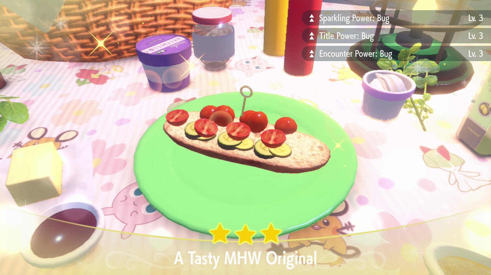

# Sandwich Maker

## Program Description

Make a sandwich of your choice.

## Setup

1. You have picniced at least once to clear in-game picnic guide.
2. For best performance, use the default tablecloth on your picnic table.
	- Other tablecloths may contain white patterns that will slow down the program detecting the white picnic hand cursor.
	- Yellow tablecloths may intefere with the bowl label reader. (??? haven't tried personally)
3. You have the ingredients in the quantities you want to use.

## Instructions

1. Enter picnic mode and select "make a sandwich."
	> Stay on the Sandwich Recipe menu.
2. Start the program in-game.

## Sandwich Recipe selection

To use a preset recipe, select it from the dropdown. Otherwise, select Custom and use the Ingredients table to pick your ingredients.

### Preset Recipes:

#### Sparkling + Title + Encounter:

The sparkling preset recipes are based off of [this](https://twitter.com/silentdestroysr/status/1597664770991468545) chart, with two extra fillings of Curry Powder for consistency. Each use will require 1x Cucumber, 1x Pickle, 3x type-specific filling, 2x Curry Powder, and 2x Herba Mystica.

#### Humungo

TODO

#### Teensy

TODO

#### Herba selection:

All preset recipes require two herba mystica to achieve Lv. 3 Sparkling Power. When selecting the Herba you have/want to use, keep in mind invalid combinations. ex. Sweet and Sour will not result in the effects you want.

### Custom:

Pick the fillings (ex. Hamburger, Onion) and condiments (ex. Ketchup, Herba) you wish to use. If you want to use an ingredient more than once, select it in multiple rows. Keep in mind the ingredient limits are six fillings and four condiments. If you exceed the limits or do not pick at least one filling and one condiment, the program will throw an error.

If the ingredient selection is valid, the program will attempt to make the sandwich. Larger fillings will be placed first. Not all custom ingredient lists are guaranteed to work, as this program is focused on making sure the preset recipes are consistently. For example, six servings of cherry tomatoes will fail, but there are no recipes that call for six servings of cherry tomatoes.

Also note that the baguette will be ignored if selected, as it has no effect on the sandwich outcome.

## Options

### Game Language:

Select the language that matches what you are using in-game. This setting is required.

### Sandwich Recipe:

See the information above.

### Herba Mystica:

See the information above.

### Go Home when Done:

Go to the Switch Home to idle when finished.

## Credits

- **Author:** kichithewolf

**Discord Server:** 

